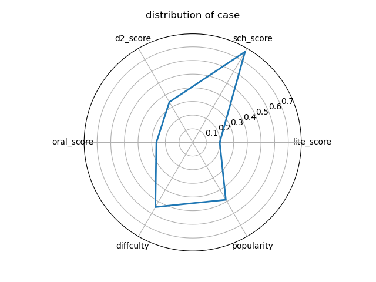

# 一个基于自然语言处理的OJ试题文本分析系统

### 1 Introduction

在本次对python练习题的数据分析实验中，我们通过使用大量多种来源数据进行监督学习，使用诸如ridge regression、svm regression、voting regressor、NN regressor等模型，构建了一个基于自然语言处理的OJ试题文本分析系统。在这个系统中，我们从**题目难度**、**题目受欢迎程度**、**二次元程度**、**文学性程度**、**学术性程度**、**口语化程度**六个角度对目标数据进行分析。并且使用数据可视化技术将结果以易于接受的形式展现出来。

### 2 Exploratory Data Analysis

#### 2.1 EDA概述

探索性数据分析（EDA）是指对已有数据在尽量少的先验假设下通过作图、制表、方程拟合、计算特征量等手段探索数据的结构和规律的一种数据分析方法。传统的统计分析方法常常先假设数据符合一种统计模型，然后依据数据样本来估计模型的一些参数及统计量，以此了解数据的特征，但实际中往往有很多数据并不符合假设的统计模型分布，这导致数据分析结果不理想。EDA则是一种更加贴合实际情况的分析方法，它强调让数据自身“说话”，通过EDA我们可以最真实、直接的观察到数据的结构及特征。

#### 2.2 数据集概述

本项目使用的额外数据集主要分成两类，一类是自然语言处理所使用的**语料集**，另一类是监督学习训练所使用的**题目信息**。

##### 2.2.1 语料集

我们使用了大量开源的语料库数据，以及一些手动收集的文本数据。

英文语料：

- Brown：来自Brown University整理的开源英文文本；
- Gutenberg：来自免费电子书搜集项目Project Gutenberg；
- Webtext：由NLTK开源库收集的文本，从Firefox论坛等获取。

中文语料：

- 中文维基百科：从中文版维基百科中爬取而来；
- 轻小说：从网络上的二次元轻小说中随机抽取收集；
- 经典文学：从网络上的著作中随机抽取收集；

- 微博语料：从微博网站爬取而来。

##### 2.2.2 **题目信息**

从OJ网站Leetcode爬取而来，包括以下信息：题目编号、题目英文标题、题目英文内容、总通过人数、总提交人数、通过率、点赞数、难度级别、题目类型、题目中文标题、题目中文内容。

```PYTHON
    def save(self, question):
        if int(question['questionId']) > 10000:
            return
        print(self.total_num,'finish')
        self.df.loc[self.total_num] = {
            'questionId':question['questionId'],
            'questionTitle':question['questionTitle'],
            'content':self.filter_tags(question['content']),
            'difficulty':question['difficulty'],
            'totalAccepted':eval(question['stats'])['totalAcceptedRaw'],
            'totalSubmission':eval(question['stats'])['totalSubmissionRaw'],
            'acRate':eval(question['stats'])['acRate'],
            'categoryTitle':question['categoryTitle'],
            'likes':question['likes'],
            'translatedTitle':question['translatedTitle'],
            'translatedContent':self.filter_tags(question['translatedContent'])
        }
        return
```

##### 2.2.3 **题目信息**的EDA分析结果

概述：


难度比例：

   

相关性分析：

   

#### 2.3 模型训练目标

我们使用，以**通过数/总提交数**代表题目难度，以**点赞数/总提交数**代表受欢迎程度，以**维基百科**训练模型评估学术性程度，以**轻小说**训练模型评估二次元程度，以**微博语料**训练模型评估口语化程度，以**经典文学**训练模型评估文学性程度。

### 3 Background

#### 3.1 机器学习技术

首先简单介绍本次实验所使用的各项机器学习技术。

##### 3.1.1 Logistic Regression

​		逻辑回归是用于分类而非回归的线性模型。逻辑回归在文献中也称为对数回归，最大熵分类或对数线性分类器。在此模型中，使用logistic函数对描述单个试验可能结果的概率进行建模 。逻辑回归实现了将二进制，一对一静止或多项式逻辑回归与可选的拟合ℓ1， ℓ2 或Elastic-Net正则化，以提高数值的稳定性。

ℓ1正则化的逻辑回归优化目标为
$$
\min_{w, c} \|w\|_1 + C \sum_{i=1}^n \log(\exp(- y_i (X_i^T w + c)) + 1)
$$
ℓ2正则化的逻辑回归优化目标为	
$$
\min_{w, c} \frac{1}{2}w^T w + C \sum_{i=1}^n \log(\exp(- y_i (X_i^T w + c)) + 1) .
$$

##### 3.1.2 Ridge Regression

​	    岭回归(ridge regression)是一种专用于共线性数据分析的有偏估计回归方法，实质上是一种改良的最小二乘估计法，通过放弃最小二乘法的无偏性，以损失部分信息、降低精度为代价获得回归系数更为符合实际、更可靠的回归方法，对病态数据的拟合要强于最小二乘法。

脊回归的优化目标为
$$
\min_{w} || X w - y||_2^2 + \alpha ||w||_2^2
$$
随着超参数alpha的变化，模型的参数weight也发生变化。总的来说，alpha越大，参数越小


##### 3.1.3 Support Vector Machine

​		在机器学习中，支持向量机（常简称为SVM，又名支持向量网络）是在分类与回归分析中分析数据的监督式学习模型与相关的学习算法。给定一组训练实例，每个训练实例被标记为属于两个类别中的一个或另一个，SVM训练算法创建一个将新的实例分配给两个类别之一的模型，使其成为非概率二元线性分类器。SVM模型是将实例表示为空间中的点，这样映射就使得单独类别的实例被尽可能宽的明显的间隔分开。然后，将新的实例映射到同一空间，并基于它们落在间隔的哪一侧来预测所属类别。除了进行线性分类之外，SVM还可以使用所谓的核技巧有效地进行非线性分类，将其输入隐式映射到高维特征空间中。当数据未被标记时，不能进行监督式学习，需要用非监督式学习，它会尝试找出数据到簇的自然聚类，并将新数据映射到这些已形成的簇。将支持向量机改进的聚类算法被称为支持向量聚类，当数据未被标记或者仅一些数据被标记时，支持向量聚类经常在工业应用中用作分类步骤的预处理。


##### 3.1.4  Random Forest

​		在随机森林中，集合中的每棵树都是根据训练集中的替换样本（即引导样本）构建的。此外，在树的构造过程中拆分每个节点时，可以从所有输入要素或size的随机子集中找到最佳拆分 max_features。这两个随机性来源的目的是减少森林估计量的方差。实际上，单个决策树通常表现出较高的方差并且倾向于过度拟合。在森林中注入的随机性产生决策树，其预测误差有些解耦。通过取这些预测的平均值，可以消除一些误差。随机森林通过组合不同的树木来减少变化，有时会以略微增加偏差为代价。在实践中，方差减小通常很明显，因此产生了总体上更好的模型。scikit-learn实现通过对分类器求平均值来组合分类器，而不是让每个分类器对单个分类投票。

##### 3.1.5 Voting Regressor

​		投票回归器(VotingRegressor)背后的思想是组合概念上不同的机器学习回归变量并返回平均预测值。这样的回归变量可用于一组性能良好的模型，以平衡其各自的弱点。

##### 3.1.6 Multi-dimensional Scaling

多维缩放(multidimensional scaling ,MDS)，是一种线性降维方式，与主成分分析法和线性降维分析法都不同的是，多维缩放的目标不是保留数据的最大可分性，而是更加关注与高维数据内部的特征。多维缩放算法集中于保留高维空间中的“相似度”信息，而在一般的问题解决的过程中，这个“相似度”通常用欧式距离来定义。

#### 3.2 自然语言处理技术

我们主要使用了基于神经网络的Word2Vec技术。

Word2vec，是一群用来产生词向量的相关模型。这些模型为浅而双层的神经网络，用来训练以重新建构语言学之词文本。网络以词表现，并且需猜测相邻位置的输入词，在word2vec中词袋模型假设下，词的顺序是不重要的。训练完成之后，word2vec模型可用来映射每个词到一个向量，可用来表示词对词之间的关系，该向量为神经网络之隐藏层。

#### 3.3 开源工具包

我们的代码基于Python实现，使用的开源工具包主要有

- scikit-learn：一个机器学习库；
- gensim：一个自然语言处理库；
- nltk：一个开源语料库；
- jieba：一个中文分词库；
- torch：一个神经网络框架；
- pandas和numpy：数据处理库。

### 4 Model

#### 4.1 基本思路

我们训练了六个模型来分析题目信息，其中难度模型和受欢迎程度模型使用维基百科语料集训练w2v模型，其余模型使用更丰富的文本训练w2v模型。

我们把题目文本作为各个模型对题目的各项特征进行分析的依据，对于其他来源的数据，大部分用于对模型进行训练，少部分用于检测模型的训练成果。对于题目文本，需要经过初步处理过滤掉无用的部分，然后将得到的有效信息转化成模型能够“看懂”的信息表述，再提供给模型进行训练或分析。

处理文本的大致思路是question -> tokens -> cleaned -> matrix ->vector。

#### 4.2 文本预处理

文本预处理主要包括除去**低频词**，**停用词**和**标点符号**。

其中低频词被认定为只出现过一次的词，而停用词是指在信息检索中，为节省存储空间和提高搜索效率，在处理自然语言数据（或文本）之前或之后会自动过滤掉的某些字或词。

本项目的停用词来自[中文停用词表](https://github.com/goto456/stopwords)。

去除低频词：

```python
frequent_tokenized_zh = []
for sentence in tokenized_zh:
    ind_list = dictionary_zh.doc2idx(sentence)
    words = []
    for i,ind in enumerate(ind_list):
        if ind != -1:
            words.append(sentence[i])
    frequent_tokenized_zh.append(words)
```

去除停用词和标点符号：

```python
def clean_text(tokenized_list, sw, punct):
    new_list = []
    for doc in tqdm(tokenized_list):
        new_list.append([token.lower() for token in doc if token.lower() not in chain(punct, sw)])
    return new_list
```

#### 4.3 Word2Vec模型训练

```python
from gensim import models

w2v_model = models.Word2Vec(all_text_data,
                        size = 300,
                        window = 5,
                        min_count = 1,
                        sg = 0,
                        alpha = 0.025,
                        iter=10,
                        batch_words = 10000)
```


#### 4.4  机器学习模型训练

区分训练集和测试集：

```python
from sklearn.model_selection import train_test_split

seed = 42
test_size = 0.33

X = vec_zh
X = np.insert(X, 0, 1, axis=1)
y = difficulty_int

X_train, X_test, y_train, y_test = train_test_split(X, y, test_size=test_size, random_state=seed)
```

Logistic Regression模型：

```python
from sklearn.linear_model import LogisticRegression

lr = LogisticRegression()
lr = lr.fit(X_train, y_train)

y_pred = lr.predict(X_test)
```

Random Forest模型：

```python
from sklearn.ensemble import RandomForestClassifier

clf = RandomForestClassifier(n_estimators=100)
clf = clf.fit(X_train, y_train)

y_pred = clf.predict(X_test)
```

神经网络：

```python
import torch
from torch import nn, optim

class NN_reg(torch.nn.Module):
    def __init__(self,feature_num):
        super(NN_reg, self).__init__()
        self.l = torch.nn.Linear(feature_num, 1)
        self.s = nn.Sigmoid()

    def forward(self, x):
        x = self.l(x)
        x = self.s(x)
        return x
    
X = torch.tensor(vec_zh).float()
y = torch.tensor(corrected_likes)
y = torch.reshape(y,(-1,1)).float()
X_train, X_test, y_train, y_test = train_test_split(X, y, test_size=test_size, random_state=seed)

net = NN_reg(X.shape[1])
```

此神经网络只有一个隐层，输出层是Sigmoid函数，看起来和Logistic Regression无异，然而，我们用这个神经网络解决回归问题，因此和Logistic Regression在损失函数上有很大不同：

```python
loss_func = torch.nn.MSELoss() 
optimizer = optim.SGD(net.parameters(), lr=0.005, momentum=0.9)

for t in range(2000):
    prediction = net(X_train)
    loss = loss_func(prediction, y_train)

    optimizer.zero_grad()
    loss.backward()
    optimizer.step()
```


### 5 Experiment

#### 5.1 Word2Vev训练

经过调整，我们使用的超参数为size = 300, window = 5, min_count = 1, sg = 0, alpha = 0.025, iter=10, batch_words = 10000。

在中文的w2v结果中，查看里“计算机”最接近的词

```python
w2v_model.wv.most_similar(positive=['计算机'])
```

结果为：

```python
[('电子计算机', 0.7262747287750244),
 ('电脑', 0.7179098725318909),
 ('程序设计', 0.6950171589851379),
 ('硬件', 0.6777796745300293),
 ('打印机', 0.6771933436393738),
 ('微处理器', 0.6766078472137451),
 ('编程语言', 0.6708018779754639),
 ('芯片', 0.66704922914505),
 ('计算机系统', 0.6664767265319824),
 ('个人电脑', 0.6633455753326416)]
```

在英文的w2v结果中，查看里“computer”最接近的词

```python
w2v_model.wv.most_similar(positive=['computer'])
```

结果为：

```python
[('certificate', 0.8047553300857544),
 ('ms', 0.7994484305381775),
 ('server', 0.7980078458786011),
 ('banking', 0.7971575856208801),
 ('ssl', 0.7907871007919312),
 ('zip', 0.7845491766929626),
 ('launches', 0.7805339097976685),
 ('user', 0.7802754640579224),
 ('helper', 0.7794123888015747),
 ('downloading', 0.777411162853241)]
```

进一步观察，我们查看中英文中离“食物”（”food“）最接近的词，并用MDS技术从原来的300维降维到2维。

中文的结果为：


英文的结果为：


#### 5.2 机器学习模型训练

文学性分析：

```python
s = '这看似宁静的大洋里隐藏着不安；那也许是远在洋底的不安的灵魂们；这广阔无垠的牧场起伏不定；多少人永远安身的墓地呀；他们为了自己的梦想而来；为了自己的梦想而死；他们留在这里就像是留在了自己的梦乡；他们翻来覆去；搅得无际的洋面波涛汹涌；这太平洋是世界的心胸；它包裹着我们藉以生存的一切；印度洋和大西洋不过是它的两条手臂；加利福尼亚的护堤更是它不屑摧毁的孩子的沙器'
cal_score(s,lr,dictionary,w2v_model)
```

文学性程度为：

```
0.583
```

学术性分析：

```python
s = '自然语言处理是计算机科学领域与人工智能领域中的一个重要方向。它研究能实现人与计算机之间用自然语言进行有效通信的各种理论和方法。自然语言处理是一门融语言学、计算机科学、数学于一体的科学。因此，这一领域的研究将涉及自然语言，即人们日常使用的语言，所以它与语言学的研究有着密切的联系，但又有重要的区别。自然语言处理并不是一般地研究自然语言，而在于研制能有效地实现自然语言通信的计算机系统，特别是其中的软件系统。因而它是计算机科学的一部分。'
cal_score(s,sch_lr,dictionary,w2v_model)
```

学术性程度为：

```
1.0
```

### 6 Data Visualization

**5.3.3.1 所有题目的六角度评分分布叠合**
   

**5.3.3.2 所有题目的六角度评分均分分布**
   

由上方图5.3.3.1-5.3.3.2可见，不愧是编程习题的文本，学术性基本都很强而文学性很弱。

下方图5.3.3.3-5.3.3.9为对Leetcode上题目编号为前200号的编程习题应用模型进行分析的的结果分布和均分，同样印证了这些文本都是编程习题题目的本质，它们拥有符合人类直觉判断的文本风格得分，也一定程度上表明了模型的有效性

**5.3.3.3 前200道二次元度分布与均分**
   

**5.3.3.4 前200道受欢迎程度分布与均分**
   

**5.3.3.5 前200道口语化程度分布与均分**
   

**5.3.3.6 前200道文学性分布与均分**
   

**5.3.3.7 前200道难度分布与均分**
   

**5.3.3.8 前200道专业性分布与均分**
   

**5.3.3.9 前200道的六性分布与均分**
   

进一步，我们希望从文本风格的分析中发掘更多有价值的信息，因而对六个性质进行了相关性分析，分析结果如下方图5.3.3.10-5.3.3.12。我们可以得到一些结论：
1、题目难度和受欢迎程度的分布基本是正态的
2、受欢迎程度受难度的影响其实不大，大家不会因为是难题就不认可这道题
3、题目中出现的不同语言风格的文本确实能在文本风格分析的结果数据中体现出一定的差异
受到数据和我们实际工作能力的影响，这些结论说不上十分强力，但已经能体现一些性质。

**5.3.3.10 难度与文本四性的相关性**
   

**5.3.3.11 六性相关性图**
   

**5.3.3.12 六性相关性散点图**
   

下图5.3.3.13是我们对模型在“难度”方面的结果进行评价的产品，acRate是leetcode上的通过率，能代表实测难度，difficulty是我们的模型产出的结果，根据分布可以隐约看出一些相关性。但想要达成“准确”的难度评价显然是不可能通过简单的文本分析完成的，我们的实验即是很好的例子

**5.3.3.13 模型与实测难度散点图**
   
类似的，由于机器没有办法简单的从文本上领会“理解”题目的难度，由下图可见，acRate代表的实测难度与文本风格之间也难以建立联系

**5.3.3.14 Leetcode实测难度与文本四性相关性**
   

### 7 Appendix

最后附上来自leetcode题目编号的几个例子

---

**Leetcode第三题——无重复字符的最长子串**

```
   给定一个字符串，请你找出其中不含有重复字符的最长子串的长度
   示例1：
   输入：“abcabcbb”
   输出：3
   示例2：
   输入：“bbbbb”
   输出：1
   示例3：
   输入：“pwwkew”
   输出：3
   解释：因为无重复字符的最长子串是“wke”，所以其长度是3
  请注意，你的答案必须是字串的长度，“pwke”是一个子序列，不是字串
```
模型分析结果如下图，能看出这道题简单精确而死板的语言风格
   

---
**Leetcode第七十题——爬楼梯**
```
   假设你正在爬楼梯。需要 n 阶你才能到达楼顶。
   每次你可以爬 1 或 2 个台阶。你有多少种不同的方法可以爬到楼顶呢？
   注意：给定 n 是一个正整数。
   示例 1：
   输入： 2
   输出： 2
   解释： 有两种方法可以爬到楼顶。
   1.  1 阶 + 1 阶
   2.  2 阶
   示例 2：
   输入： 3
   输出： 3
   解释： 有三种方法可以爬到楼顶。
   1.  1 阶 + 1 阶 + 1 阶
   2.  1 阶 + 2 阶
   3.  2 阶 + 1 阶
```
模型分析结果如下图，能看出这道题相比之下不那么死板的语言风格，注意本题模型在难度方面打出了相对高分，这是我们尚无法理解的
   

---
**Leetcode第一百二十一题——买卖股票的最佳时机**
```
    给定一个数组，它的第 i 个元素是一支给定股票第 i 天的价格。
    如果你最多只允许完成一笔交易（即买入和卖出一支股票一次），设计一个算法来计算你所能获取的最大利润。
    注意：你不能在买入股票前卖出股票。

    示例 1:
    输入: [7,1,5,3,6,4]
    输出: 5
    解释: 在第 2 天（股票价格 = 1）的时候买入，在第 5 天（股票价格 = 6）的时候卖出，最大利润 = 6-1 = 5 。
         注意利润不能是 7-1 = 6, 因为卖出价格需要大于买入价格；同时，你不能在买入前卖出股票。
    示例 2:
    输入: [7,6,4,3,1]
    输出: 0
    解释: 在这种情况下, 没有交易完成, 所以最大利润为 0。
```
模型分析结果如下图，能看出这道题相比之下很高的学术性语言风格评分，我们认为这跟股票这一特定名词有很大关系，对股票的分析语言通常是高学术性的
   